# LAFISE Challenge

Monorepo para la prueba técnica de banca digital.

## Estructura

```text
apps/
├── api/    # Mock backend oficial
└── web/    # Aplicación Next.js
```

## Desarrollo

Instala las dependencias del frontend desde la raíz:

```bash
yarn install
```

Instala las dependencias del mock con npm:

```bash
npm install --prefix apps/api
```

Luego levanta el backend y el frontend con:

```bash
yarn dev
```

También puedes levantarlos por separado:

```bash
yarn dev:api
yarn dev:web
```

## Validación

```bash
yarn lint
yarn build
```

## Variables de entorno

En producción, `apps/web` requiere la URL pública del mock. La variable se usa
únicamente en el servidor de Next.js para evitar problemas de CORS en el navegador:

```env
API_URL=https://tu-api.onrender.com
```

## Galería de la aplicación

### Vistas de escritorio

<p align="center">
  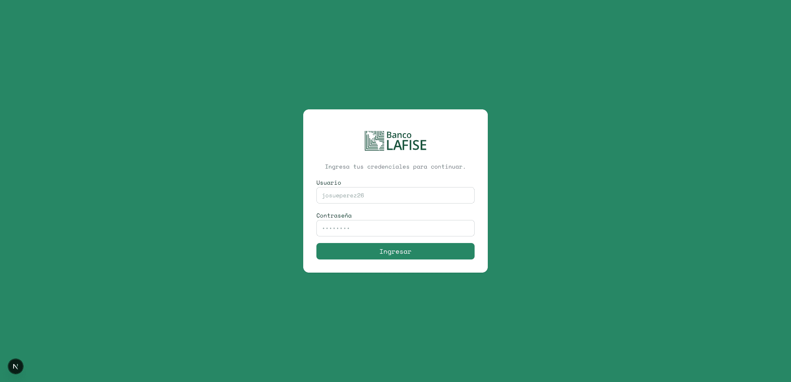
  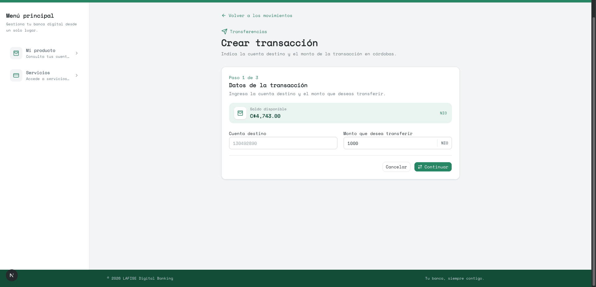
</p>

<p align="center">
  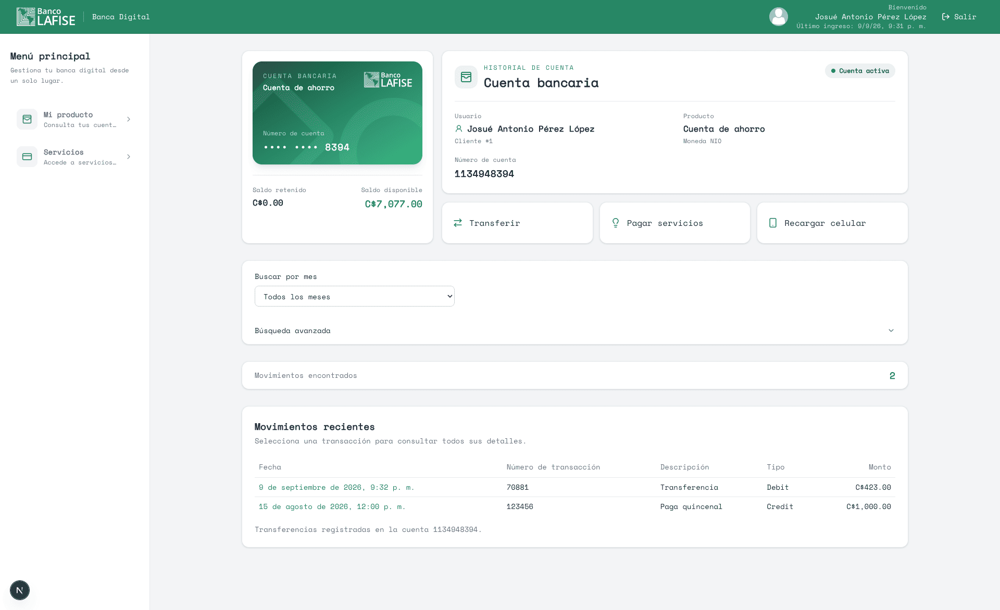
  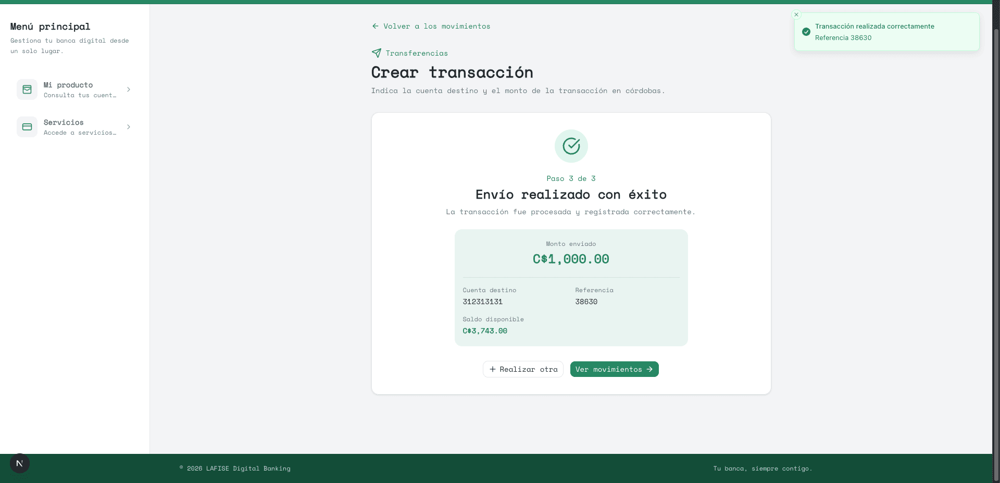
</p>

<p align="center">
  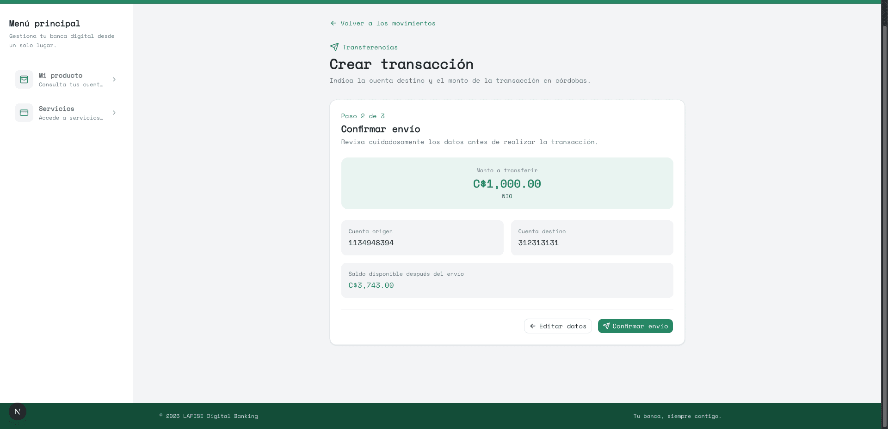
  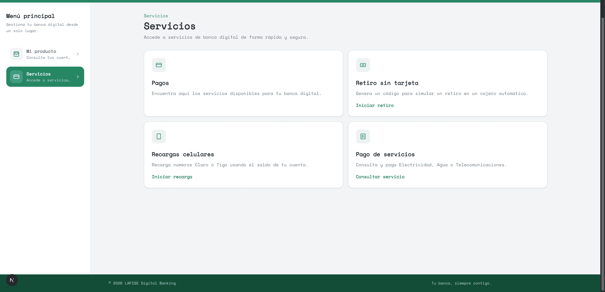
</p>

### Vistas móviles

<p align="center">
  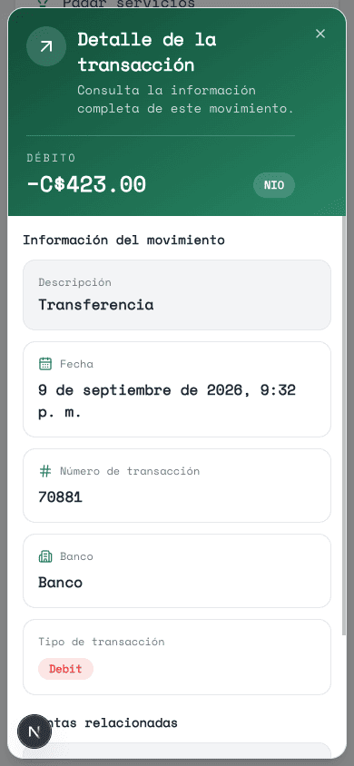
  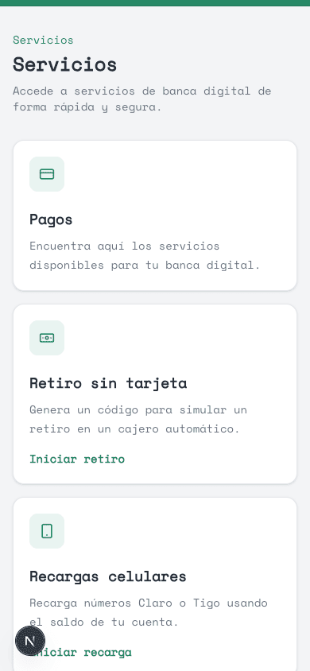
  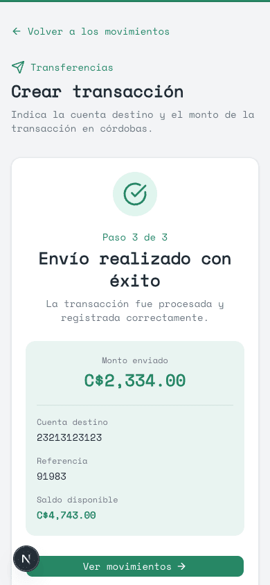
  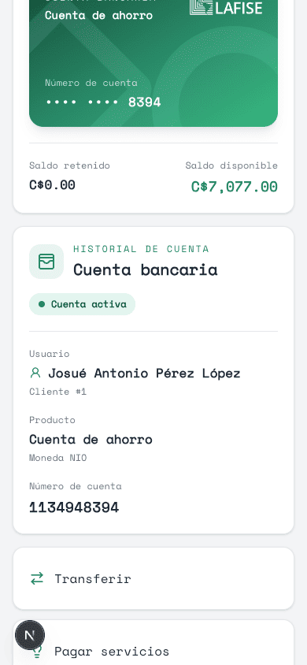
</p>

<p align="center">
  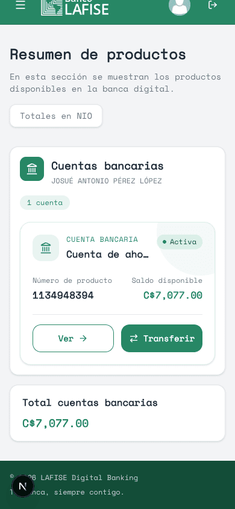
  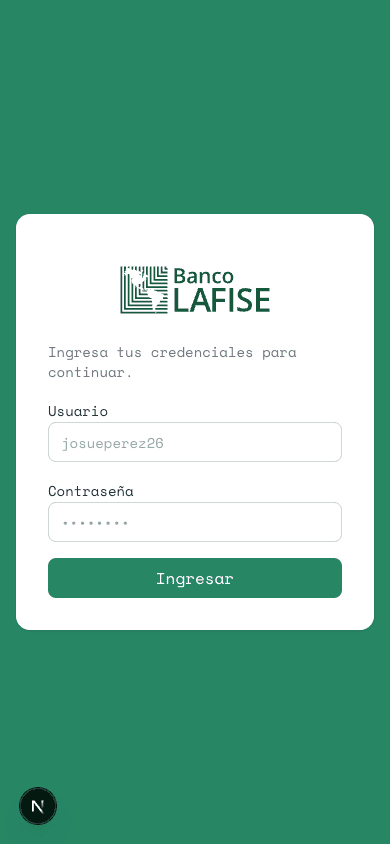
  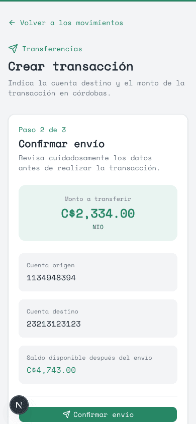
</p>
